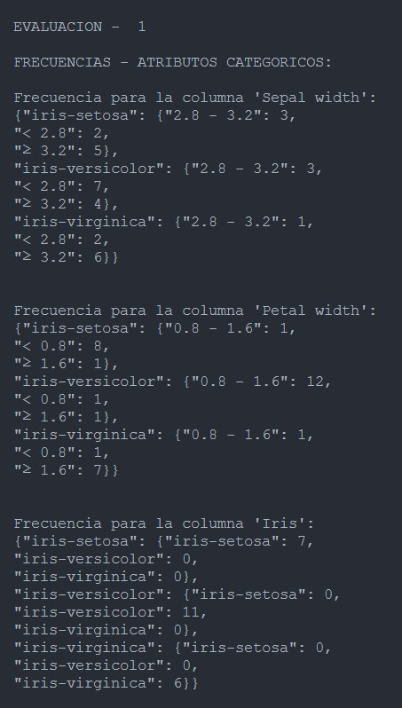
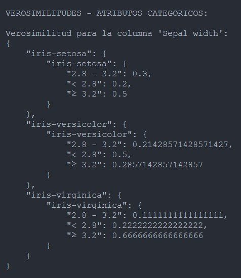
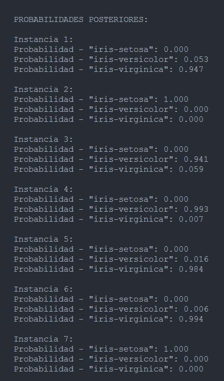
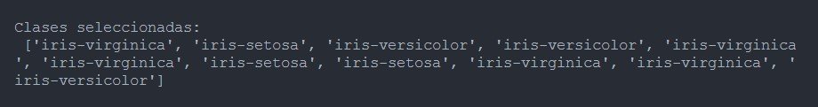
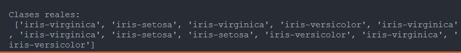

# Naive-Bayes
Actividad 09: Implementación de Naïve Bayes y matrices de confusión

Materia: Minería De Datos - D02 - 2023B

Profesor: Israel Román Godínez

Fecha: 09/10/2023

Alumnos:

Aldape Rodríguez Kevin Jair.

Duarte Vázquez Kevin Alexis.

Venegas Garibay Ali.

# Resultados:

<h2> Calculo de frecuencias en atributos categoricos: </h2> 

<h2> Calculo de verosimilitudes en atributos categoricos: </h2> 

<h2> Calculo de verosimilitudes en atributos numericos: </h2> 

<h2> Probabilidades Posteriores: </h2> 

<h2> Clases obtenidas por el modelo: </h2> 

<h2> Clases esperadas: </h2> 

<h2> Matriz de confusión, Recall de clases, Presición de clases y Exactitud del modelo: </h2> 

